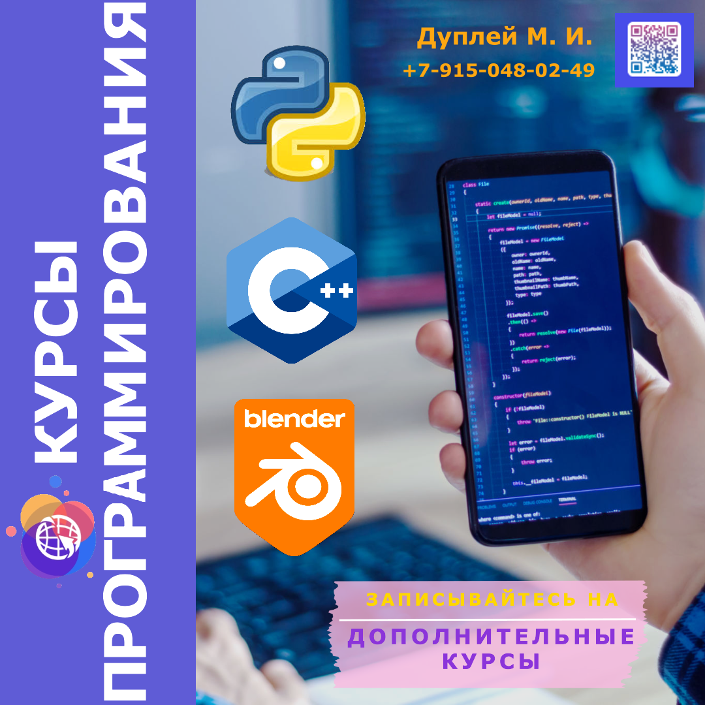
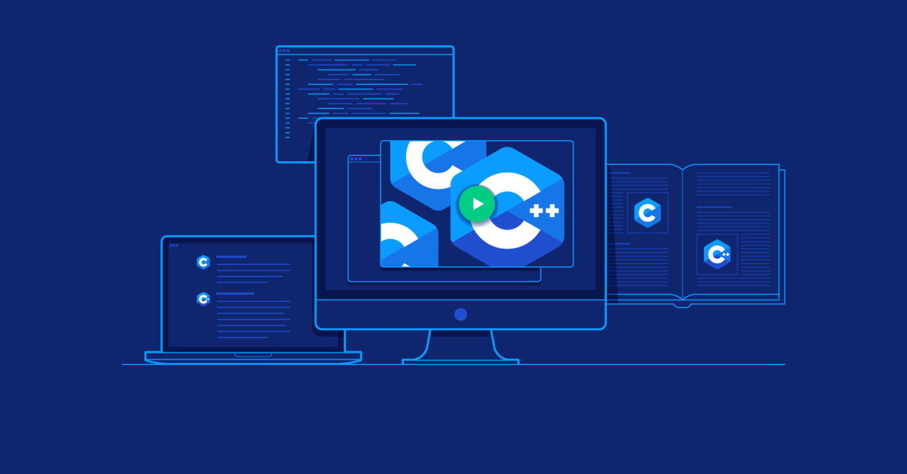
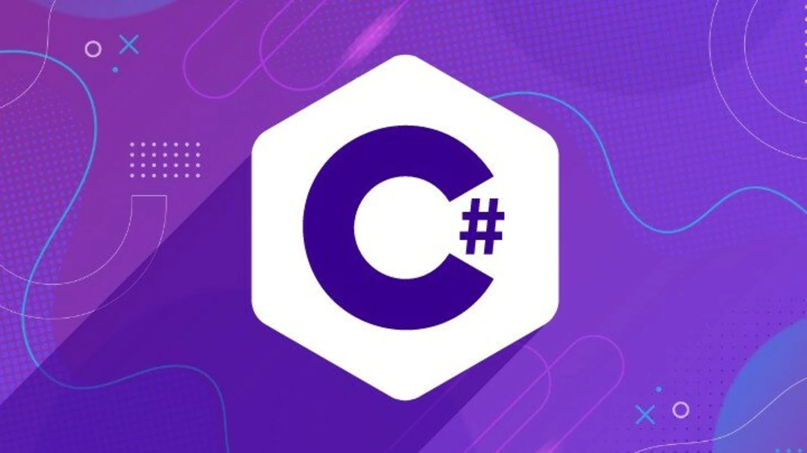
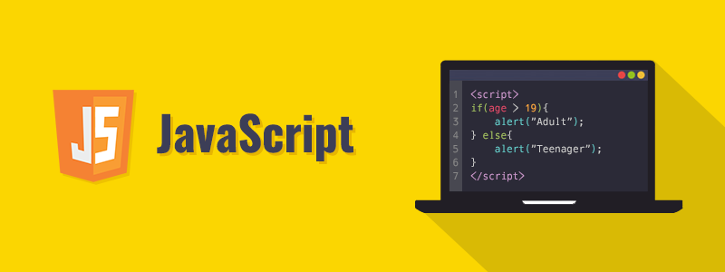
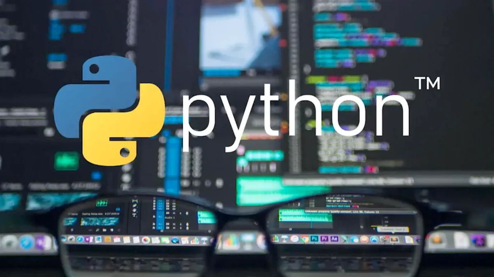

# Школа программирования Maestro7IT

<!--  -->



## [🌐 Программирование на С++ для начинающих </>](https://github.com/QuadDarv1ne/maestro7it_education/tree/main/c_plus_plus)

Это процесс освоения основ языка программирования C++, который является мощным и универсальным инструментом для создания различных типов программ, от системных до прикладных приложений.

C++ используется в широком спектре областей, включая разработку игр, создание операционных систем, а также научные вычисления и финансовые приложения.



## [🌐 Программирование на СSharp для начинающих </>](https://github.com/QuadDarv1ne/maestro7it_education/tree/main/c_sharp)

Это освоение языка программирования C#, который используется для разработки широкого спектра приложений, включая настольные, веб и мобильные приложения.

C# является объектно-ориентированным языком, поддерживающим как традиционное, так и современное программирование, и является основным языком для платформы .NET, созданной Microsoft.



## [🌐 Программирование на JavaScript для начинающих </>](https://github.com/QuadDarv1ne/maestro7it_education/tree/main/javascript)

Это процесс изучения основ языка JavaScript, который является одним из самых популярных языков программирования для разработки веб-приложений.

JavaScript используется для добавления интерактивности и динамических функций на веб-страницах.

Он выполняется в браузере, что позволяет изменять содержимое веб-страницы, взаимодействовать с сервером и создавать различные пользовательские интерфейсы.



## [🌐 Программирование на Python для начинающих </>](https://github.com/QuadDarv1ne/maestro7it_education/tree/main/python)

Это изучение одного из самых популярных языков программирования, который используется для разработки веб-приложений, анализа данных, автоматизации процессов, машинного обучения и многих других областей.

Python славится своей простотой и читаемостью, что делает его отличным выбором для новичков.
 



💼 **Автор:** Дуплей Максим Игоревич

📲 **Telegram:** @quadd4rv1n7

📅 **Дата:** 07.09.2024

▶️ **Версия 1.0**

```
※ Предложения по сотрудничеству можете присылать на почту ※
📧 maksimqwe42@mail.ru
```
