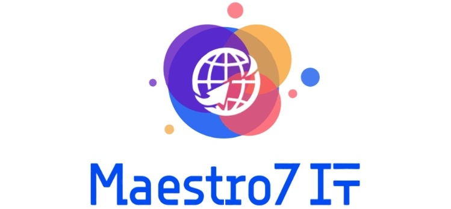
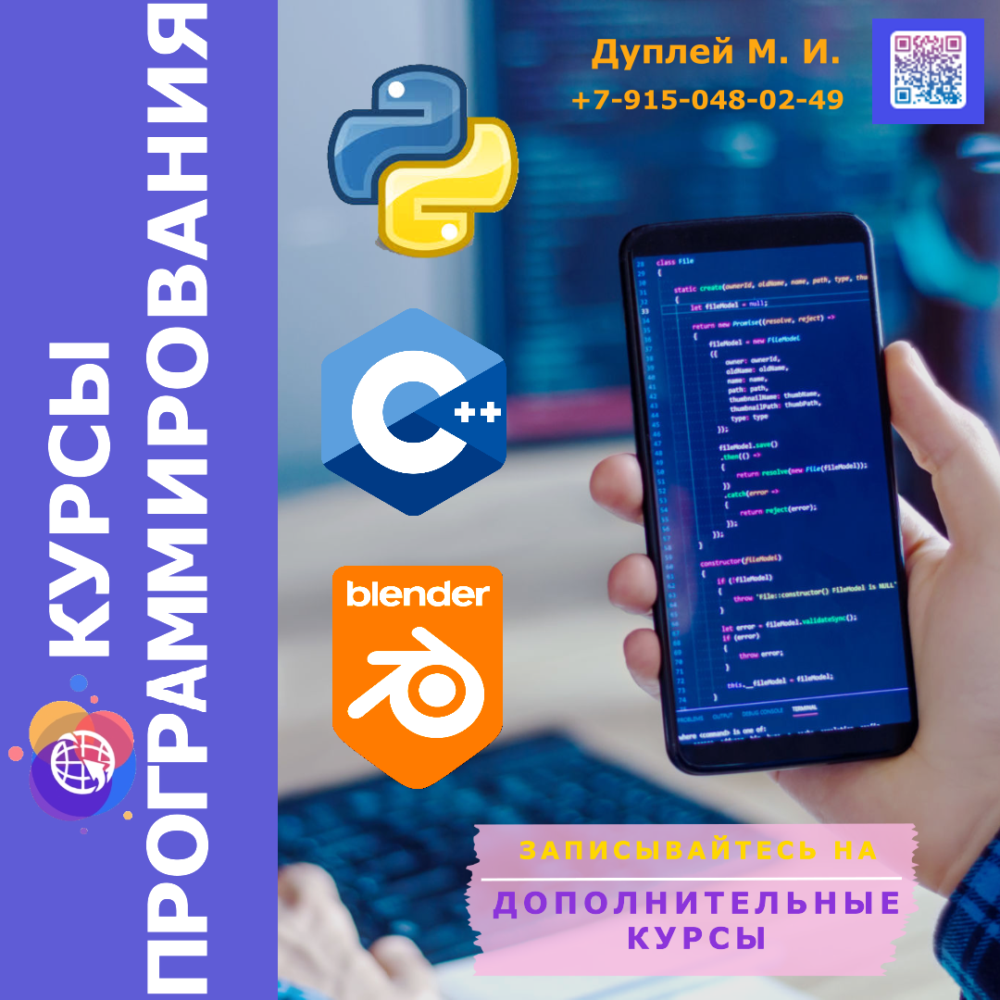
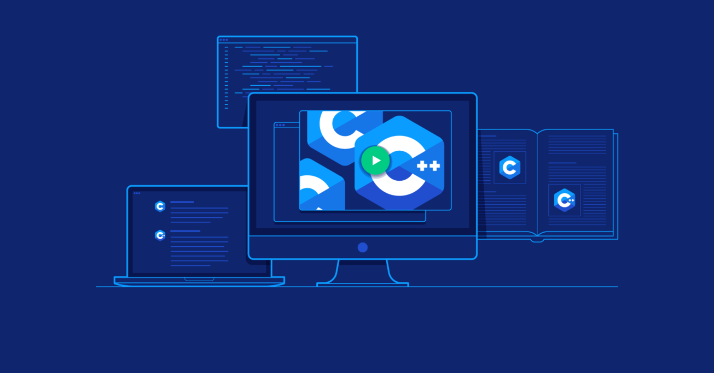
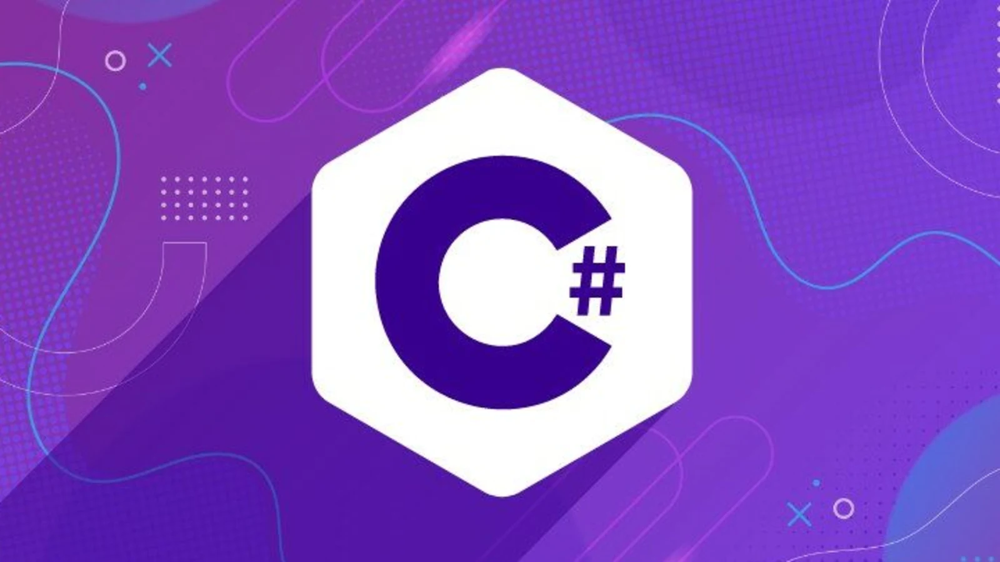
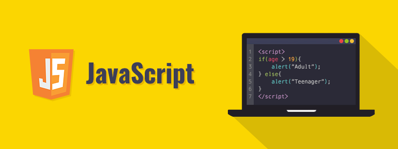
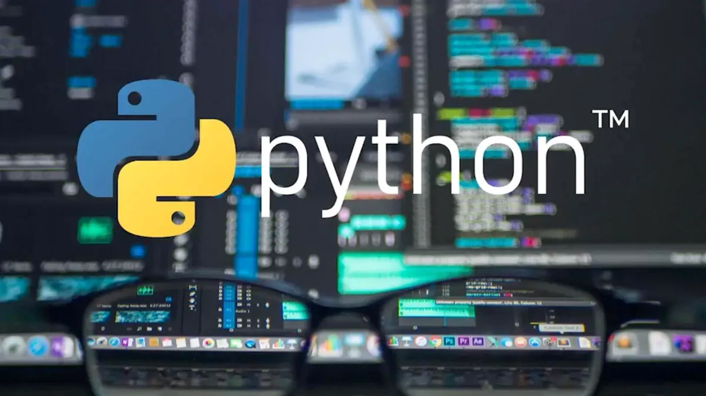

# Школа программирования Maestro7IT

[](https://orcid.org/0009-0007-7605-539X)
[](https://github.com/QuadDarv1ne/maestro7it_education/blob/main/README.md)

<!--  -->




## [🌐 Программирование на С++ для начинающих </>](https://github.com/QuadDarv1ne/maestro7it_education/tree/main/c_plus_plus)

Это процесс освоения основ языка программирования C++, который является мощным и универсальным инструментом для создания различных типов программ, от системных до прикладных приложений.

C++ используется в широком спектре областей, включая разработку игр, создание операционных систем, а также научные вычисления и финансовые приложения.



## [🌐 Программирование на СSharp для начинающих </>](https://github.com/QuadDarv1ne/maestro7it_education/tree/main/c_sharp)

Это процесс освоения языка программирования C#, который используется для разработки широкого спектра приложений, включая настольные, веб и мобильные приложения.

C# является объектно-ориентированным языком, поддерживающим как традиционное, так и современное программирование, и является основным языком для платформы .NET, созданной Microsoft.



## [🌐 Программирование на JavaScript для начинающих </>](https://github.com/QuadDarv1ne/maestro7it_education/tree/main/javascript)

Это процесс изучения основ языка JavaScript, который является одним из самых популярных языков программирования для разработки веб-приложений.

JavaScript используется для добавления интерактивности и динамических функций на веб-страницах.

Он выполняется в браузере, что позволяет изменять содержимое веб-страницы, взаимодействовать с сервером и создавать различные пользовательские интерфейсы.



## [🌐 Программирование на Python для начинающих </>](https://github.com/QuadDarv1ne/maestro7it_education/tree/main/python)

Это процесс изучения одного из самых популярных языков программирования, который используется для разработки веб-приложений, анализа данных, автоматизации процессов, машинного обучения и многих других областей.

Python славится своей простотой и читаемостью, что делает его отличным выбором для новичков.




---

### 📄 Лицензия

[Этот проект лицензирован под лицензией MIT](LICENCE)

Для получения дополнительной информации ознакомьтесь с файлом `LICENSE`

---

#### ♟️ Maksim Dupley | Chess Profile

> **FIDE ID:** [540098680](https://ratings.fide.com/profile/540098680)  
**Федерация:** Россия  
**Год рождения:** 1999  
**Титул FIDE:** `Arena FIDE Master (AFM)`

> [Официальный профиль ФИДЕ](https://ratings.fide.com/profile/540098680)

> [Профиль на World Chess](https://worldchess.com/profile/1094367)

---

### 💼 Профиль на Profi.ru

[](https://profi.ru/profile/DupleyMI)

> Консультации и услуги программирования на платформе Profi.ru

---

### 📚 Услуги обучения

[](https://kwork.ru/usability-testing/42465951/obuchenie-tekhnologiyam-i-yazykam-programmirovaniya)

> Профессиональное обучение технологиям и языкам программирования. Персональные консультации и курсы от опытного преподавателя.

---

### 🏫 О школе

[](https://school-maestro7it.ru/)

> Инновационная школа программирования, специализирующаяся на подготовке специалистов в области современных технологий и языков программирования.

---

💼 **Автор:** Дуплей Максим Игоревич

📲 **Telegram №1:** [@quadd4rv1n7](https://t.me/quadd4rv1n7)

📲 **Telegram №2:** [@dupley_maxim_1999](https://t.me/dupley_maxim_1999)

📅 **Дата:** 07.09.2024

▶️ **Версия 3.0**

```textline
※ Предложения по сотрудничеству можете присылать на почту ※
📧 maksimqwe42@mail.ru
```

[](https://star-history.com/#QuadDarv1ne/maestro7it_education&Date)
