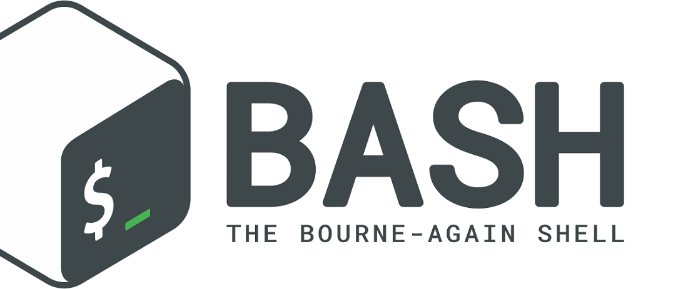

# Школа программирования Maestro7IT


## 🌐 Программирование на BASH для Linux и Windows </>



### План обучения

```textline
▶️ Перечень уроков (вебинаров) для онлайн-курса по программированию на BASH:
1️⃣ Введение в BASH и настройка среды
2️⃣ Основные команды и синтаксис BASH
3️⃣ Переменные и типы данных в BASH
4️⃣ Управляющие конструкции: условные операторы и циклы
5️⃣ Функции в BASH
6️⃣ Перенаправление ввода и вывода
7️⃣ Лучшие практики написания скриптов
8️⃣ Продвинутая обработка текста
9️⃣ Работа с файлами и директориями
1️⃣0️⃣ Сетевые команды и удалённый доступ
1️⃣1️⃣ Управление процессами
1️⃣2️⃣ Настройка оболочки
1️⃣3️⃣ Особенности BASH на Linux
1️⃣4️⃣ Особенности BASH на Windows
1️⃣5️⃣ Автоматизация и проекты на BASH
1️⃣6️⃣ Итоговый вебинар: обзор и Q&A
```

---

## Подробное описание уроков

1. Введение в `BASH` и настройка среды

    - Обзор `BASH` и его значимость
    - Настройка окружения на `Linux` и `Windows` (`Git Bash`, `WSL`)
    - Основы навигации и команды для работы с файловой системой

2. Основные команды и синтаксис `BASH`

    - Понимание приглашения оболочки
    - Команды для работы с файлами и директориями (`ls`, `cd`, `mkdir`, `rm` и др.)
    - Команды для обработки текста (`cat`, `echo`, `grep`, `sed`, `awk`)

3. Переменные и типы данных в BASH  

    - Объявление и использование переменных
    - **Типы данных:** строки, целые числа, массивы
    - Переменные окружения и их использование

4. **Управляющие конструкции:** условные операторы и циклы  

    - Операторы `if-else`
    - Циклы `for`, `while`, `until`
    - Оператор case для обработки нескольких условий

5. Функции в `BASH`

    - Определение и вызов функций
    - Передача аргументов в функции
    - Возврат значений из функций

6. Перенаправление ввода и вывода

    - Перенаправление стандартного ввода, вывода и ошибок
    - Использование конвейеров (pipes) для соединения команд
    - Here-документы и here-строки

7. Лучшие практики написания скриптов

    - Написание читаемых и поддерживаемых скриптов
    - Техники отладки
    - Обработка ошибок и статусов выхода

8. Продвинутая обработка текста

    - Регулярные выражения с `grep` и `sed`
    - Использование `awk` для сложной обработки текста
    - Команды `cut`, `sort`, `uniq` и другие утилиты

9. Работа с файлами и директориями

    - Права доступа и владельцы файлов
    - Поиск файлов с помощью `find`
    - Архивирование и сжатие файлов (`tar`, `gzip` и др.)

10. Сетевые команды и удалённый доступ

    - Основные сетевые команды (`ping`, `netstat` и др.)
    - Использование `SSH` для удалённого доступа и передачи файлов
    - Команды `wget` и `curl` для загрузки файлов

11. Управление процессами

    - Просмотр и управление процессами (`ps`, `top`, `kill`)
    - Фоновые и передние задачи
    - Планирование задач с помощью `cron` и `at`

12. Настройка оболочки

    - Настройка окружения оболочки (`.bashrc`, `.bash_profile`)
    - Создание псевдонимов (`aliases`) и функций для повышения производительности
    - Настройка приглашения оболочки

13. Особенности `BASH` на `Linux`

    - Управление пакетами (`apt`, `yum` и др.)
    - `Systemd` и управление службами
    - Команды и инструменты, специфичные для `Linux`

14. Особенности `BASH` на `Windows`

    - Использование `BASH` на `Windows` через `WSL` или `Git Bash`
    - Взаимодействие с файловой системой и инструментами `Windows`
    - Команды и утилиты, специфичные для `Windows`

15. Автоматизация и проекты на `BASH`

    - Примеры реальных скриптов (например, скрипты резервного копирования, анализ логов)
    - Автоматизация повторяющихся задач
    - Интеграция `BASH-скриптов` с другими инструментами и языками

16. **Итоговый вебинар:** обзор и `Q&A`

    - Повторение ключевых концепций  
    - Сессия вопросов и ответов
    - Ресурсы для дальнейшего обучения

---

Этот план обучения охватывает все необходимые темы для освоения `BASH` на `Linux` и `Windows`, от базовых команд до продвинутых техник автоматизации.

Он подойдёт как для начинающих, так и для тех, кто хочет углубить свои знания в области скриптинга и работы с командной строкой.

---

💼 **Автор:** Дуплей Максим Игоревич

📲 **Telegram:** @quadd4rv1n7

📅 **Дата:** 15.03.2025

▶️ **Версия 1.0**

```textline
※ Предложения по сотрудничеству можете присылать на почту ※  
📧 maksimqwe42@mail.ru
