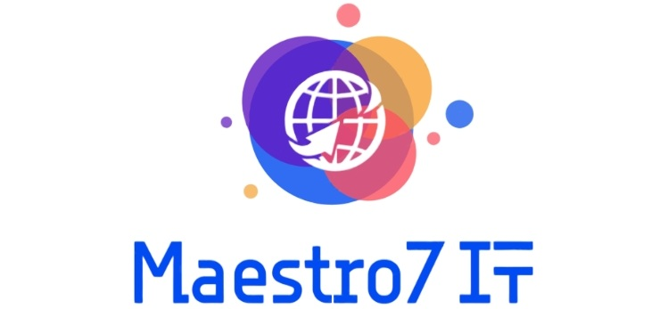

# Школа программирования Maestro7IT



## Программирование на С++ для начинающих </>


### План обучения
```
▶️ Перечень уроков (вебинаров) для онлайн-курса по программированию на C++:
1️⃣ Введение в C++ и настройка среды разработки
2️⃣ Базовые синтаксические конструкции: переменные, типы данных и операторы
3️⃣ Условные операторы и циклы
4️⃣ Функции в C++: объявление, параметры, возвращаемые значения
5️⃣ Массивы и строки: основы работы с последовательностями данных
6️⃣ Указатели и работа с памятью
7️⃣ Структуры и объединения: пользовательские типы данных
8️⃣ Классы и объекты: основы объектно-ориентированного программирования
9️⃣ Наследование и полиморфизм
1️⃣0️⃣ Обработка исключений и работа с ошибками
1️⃣1️⃣ Шаблоны и обобщённое программирование
1️⃣2️⃣ Работа с файлами и потоками
1️⃣3️⃣ Стандартная библиотека шаблонов (STL)
1️⃣4️⃣ Управление памятью и оптимизация производительности
1️⃣5️⃣ Итоговый вебинар
```


**Автор:** Дуплей Максим Игоревич

**Дата:** 07.09.2024

**Версия 1.0**
