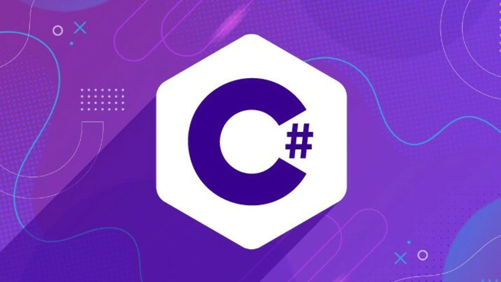

# Школа программирования Maestro7IT


## 🌐 Программирование на С# для начинающих </>



### План обучения

```textline
▶️ Перечень уроков (вебинаров) для онлайн-курса по программированию на CSharp:
1️⃣ Введение в C#: Установка и настройка среды разработки
- - - Установка .NET SDK и IDE (Visual Studio, VS Code)
- - - Структура C# программы
- - - Первая программа на C#
2️⃣ Переменные, типы данных и операторы
- - - Переменные и типы данных
- - - Операторы: арифметические, логические и сравнения
- - - Встроенные функции для работы с типами данных
3️⃣ Условные операторы и циклы
- - - Конструкции if, else if, else
- - - Циклы for, while, do-while
- - - Управление циклами: break, continue
4️⃣ Функции и методы
- - - Объявление и вызов методов
- - - Параметры методов и возвращаемые значения
- - - Перегрузка методов
5️⃣ Массивы и коллекции
- - - Одномерные и многомерные массивы
- - - Коллекции: списки, словари, очереди и стеки
- - - Работа с коллекциями и их итерация
6️⃣ Обработка строк
- - - Основные операции со строками
- - - Конкатенация и форматирование строк
- - - Введение в регулярные выражения
7️⃣ Объектно-Ориентированное Программирование (ООП)
- - - Классы и объекты
- - - Инкапсуляция, наследование и полиморфизм
- - - Конструкторы и деструкторы
8️⃣ Интерфейсы и абстрактные классы
- - - Объявление интерфейсов
- - - Реализация абстрактных классов
- - - Различие между интерфейсами и абстрактными классами
9️⃣ Обработка исключений
- - - Конструкция try, catch, finally
- - - Создание собственных исключений
- - - Работа с исключениями и их обработка
1️⃣0️⃣ Работа с файлами
- - - Чтение и запись файлов
- - - Работа с текстовыми и бинарными файлами
- - - Потоковый ввод/вывод
1️⃣1️⃣ Работа с базами данных
- - - Основы работы с SQL
- - - Подключение к базам данных через ADO.NET
- - - Операции с базами данных (CRUD)
1️⃣2️⃣ Асинхронное программирование
- - - Асинхронные задачи (async и await)
- - - Работа с потоками
- - - Управление параллелизмом
1️⃣3️⃣ Создание графических интерфейсов (Windows Forms/WPF)
- - - Введение в Windows Forms
- - - Основы WPF (Windows Presentation Foundation)
- - - Разработка простых приложений с графическим интерфейсом
1️⃣4️⃣ Работа с веб-приложениями на ASP.NET Core
- - - Введение в ASP.NET Core
- - - Создание простого веб-приложения
- - - Взаимодействие с базами данных через Entity Framework
1️⃣5️⃣ Итоговый вебинар (Итоговый проект и обзор курса)
- - - Разработка полноценного проекта
- - - Подведение итогов и обзор всех пройденных тем
- - - Рекомендации по дальнейшему изучению
```


---

💼 **Автор:** Дуплей Максим Игоревич

📲 **Telegram №1:** [@quadd4rv1n7](https://t.me/quadd4rv1n7)

📲 **Telegram №2:** [@dupley_maxim_1999](https://t.me/dupley_maxim_1999)

📅 **Дата:** 07.09.2024

▶️ **Версия 1.0**

```textline
※ Предложения по сотрудничеству можете присылать на почту ※
📧 maksimqwe42@mail.ru
```
