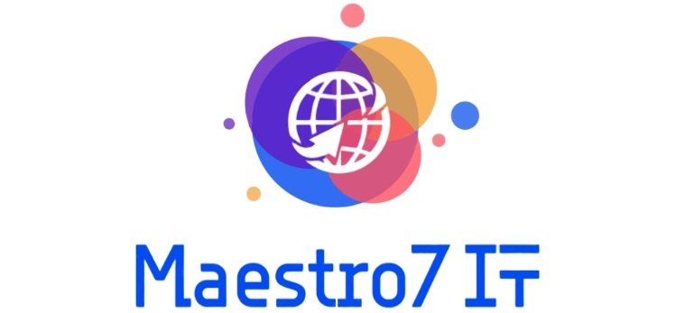

# Школа программирования Maestro7IT



## 🌐 Программирование на GOlang для начинающих </>

`Go` — это современный компилируемый язык с открытым исходным кодом, разработанный `Google` в 2009 году.

Он сочетает простоту синтаксиса, высокую производительность и эффективную работу с многопоточностью.

### Ключевые особенности

1. `Простота и читаемость`
   - Минималистичный синтаксис без лишних конструкций.
   - Четкое форматирование через `gofmt`

2. `Высокая производительность`
   - Компиляция в нативный код (нет виртуальной машины).
   - Сопоставим со скоростью `C/C++` для многих задач.

3. `Параллелизм`
   - **Горутины (легковесные потоки)** и каналы для асинхронных операций.
   - Проще, чем классические многопоточные модели.

4. `Статическая типизация`
   - Безопасность типов на этапе компиляции.
   - Автоматический вывод типов (`:=`).

5. `Сборка мусора`
   - Управление памятью без явного выделения/освобождения.

6. `Стандартная библиотека`
   - Богатый набор пакетов для работы с сетью, файлами, шифрованием и т.д.

### План обучения

```printline
▶️ Перечень уроков (вебинаров) для онлайн-курса по программированию на `GOlang`:
1️⃣ 
- - -
2️⃣ 
- - -
3️⃣ 
- - -
4️⃣ 
- - -
5️⃣ 
- - -
6️⃣ 
- - -
7️⃣ 
- - -
8️⃣ 
- - -
9️⃣ 
- - -
1️⃣0️⃣ 
- - -
1️⃣1️⃣ 
- - -
1️⃣2️⃣ 
- - -
1️⃣3️⃣ 
- - -
1️⃣4️⃣ 
- - -
1️⃣5️⃣ 
- - -
```


---

💼 **Автор:** Дуплей Максим Игоревич

📲 **Telegram №1:** [@quadd4rv1n7](https://t.me/quadd4rv1n7)

📲 **Telegram №2:** [@dupley_maxim_1999](https://t.me/dupley_maxim_1999)

📅 **Дата:** 01.05.2025

▶️ **Версия 1.0**

```textline
※ Предложения по сотрудничеству можете присылать на почту ※
📧 maksimqwe42@mail.ru
```
