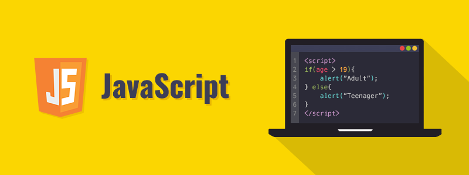

# Школа программирования Maestro7IT


## 🌐 Программирование на JavaScript для начинающих </>



### План обучения

```
▶️ Перечень уроков (вебинаров) для онлайн-курса по программированию на JavaScript:
1️⃣ Введение в JavaScript: Установка и настройка среды разработки
- - - История и применение JavaScript
- - - Установка редактора кода (Visual Studio Code)
- - - Первые шаги с JavaScript в браузере
2️⃣ Основы синтаксиса: Переменные, типы данных и операторы
- - - Объявление переменных (var, let, const)
- - - Типы данных: строки, числа, булевые значения
- - - Основные операторы (арифметические, логические, сравнения)
3️⃣ Условные операторы и циклы
- - - Конструкции if, else, switch
- - - Циклы for, while, do-while
- - - Управляющие операторы: break, continue
4️⃣ Функции: объявление и вызов
- - - Определение функций
- - - Аргументы функций и возвращаемые значения
- - - Замыкания и контексты функций
5️⃣ Массивы и объекты
- - - Создание и работа с массивами
- - - Объекты: ключи и значения
- - - Встроенные методы для работы с массивами и объектами
6️⃣ Работа со строками
- - - Основные методы для работы со строками
- - - Конкатенация и интерполяция строк
- - - Шаблонные строки
7️⃣ Объектно-Ориентированное Программирование в JavaScript
- - - Классы и объекты
- - - Наследование и полиморфизм
- - - Методы классов
8️⃣ Асинхронное программирование: Promises, async/await
- - - Работа с асинхронными операциями
- - - Создание и использование Promises
- - - Асинхронные функции с async/await
9️⃣ DOM: Манипуляция элементами веб-страницы
- - - Поиск элементов в DOM
- - - Изменение содержимого и стилей элементов
- - - Работа с событиями и слушателями событий
1️⃣0️⃣ Работа с веб-API: AJAX и Fetch
- - - Основы работы с API
- - - Использование XMLHttpRequest и fetch
- - - Отправка данных через POST-запросы
1️⃣1️⃣ Модули и современный JavaScript (ES6+)
- - - Импорт и экспорт модулей
- - - Деструктуризация, стрелочные функции, шаблонные строки
- - - Нововведения в ES6+
1️⃣2️⃣ Работа с LocalStorage и SessionStorage
- - - Основы хранения данных в браузере
- - - Чтение и запись данных в LocalStorage
- - - Использование SessionStorage
1️⃣3️⃣ Тестирование JavaScript кода
- - - Введение в тестирование
- - - Написание простых тестов с использованием фреймворков (например, Jest)
- - - Юнит-тестирование и тестирование компонентов
1️⃣4️⃣ Введение в Node.js: Серверная часть JavaScript
- - - Установка и настройка Node.js
- - - Основы работы с файловой системой
- - - Создание простого HTTP-сервера
1️⃣5️⃣ Итоговый вебинар (Разработка полноценного приложения)
- - - Разработка проекта с использованием всех пройденных тем
- - - Разбор и обсуждение решений
- - - Заключение и рекомендации по дальнейшему изучению
```


---

💼 **Автор:** Дуплей Максим Игоревич

📲 **Telegram:** @quadd4rv1n7

📅 **Дата:** 07.09.2024

▶️ **Версия 1.0**

```textline
※ Предложения по сотрудничеству можете присылать на почту ※
📧 maksimqwe42@mail.ru
```
