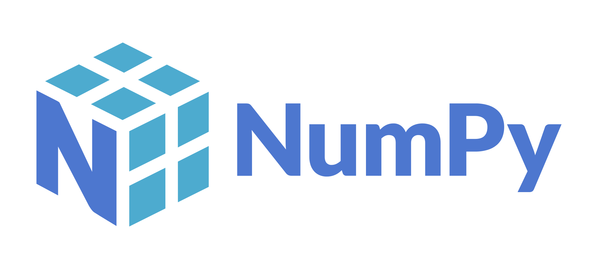

# Школа программирования Maestro7IT


## [🌐 NumPy: Путеводитель по научным вычислениям на Python </>]()



### План обучения

```
▶️ Перечень уроков (вебинаров) для онлайн-курса:

**ВВЕДЕНИЕ**
1️⃣ Что такое NumPy ?
- - - История и применение
- - - Установка библиотеки
2️⃣ Установка NumPy
- - - Установка через pip: `pip install numpy`
- - - Проверка установки

**ОСНОВЫ NumPy**
3️⃣ Создание массивов
- - - Одномерные массивы: `np.array()`
- - - Многомерные массивы
- - - Создание массивов с помощью `np.zeros()`, `np.ones()`, `np.arange()`, `np.linspace()`
4️⃣ Атрибуты массивов
- - - Размерность: ndim
- - - Форма: shape
- - - Тип данных: dtype
- - - Размер: size
5️⃣ Индексация и срезы
- - - Доступ к элементам массива
- - - Срезы и маски
- - - Изменение элементов массива

**ОCНОВНЫЕ ОПЕРАЦИИ**
6️⃣ Арифметические операции
- - - Сложение, вычитание, умножение, деление
- - - Операции над массивами разной размерности
7️⃣ Математические функции
- - - Основные функции: np.mean(), np.sum(), np.std(), np.var()
- - - Функции работы с массивами: np.min(), np.max(), np.argmin(), np.argmax()
8️⃣ Линейная алгебра
- - - Умножение матриц: np.dot()
- - - Обратная матрица: np.linalg.inv()
- - - Определитель матрицы: np.linalg.det()

**ПРОДВИНУТЫЕ ФУНКЦИИ**
9️⃣ Условные операции
- - - Массивы логических значений
- - - Условные выражения с np.where()
1️⃣0️⃣ Работа с пропущенными данными
- - - Обработка NaN значений: np.isnan(), np.nanmean()
- - - Заполнение и удаление пропусков
1️⃣1️⃣ Преобразование массивов
- - - Изменение формы массива: reshape(), flatten()
- - - Транспонирование: T
1️⃣2️⃣ Сортировка и уникальные значения
- - - Сортировка: np.sort(), np.argsort()
- - - Уникальные значения: np.unique()

**ИНТЕГРАЦИЯ И ПРОИЗВОДИТЕЛЬНОСТЬ**
1️⃣3️⃣ Интеграция с другими библиотеками
- - - Взаимодействие с Pandas: преобразование между DataFrame и NumPy массивами
- - - Использование NumPy в научных вычислениях
1️⃣4️⃣ Производительность и оптимизация
- - - Векторизация операций
- - - Использование специализированных функций и методов для оптимизации

**ПРОЕКТ И ПРИМЕРЫ**
1️⃣5️⃣ Реализация проекта
- - - Пример проекта: анализ и визуализация данных
- - - Построение графиков с использованием Matplotlib и NumPy

1️⃣6️⃣ Примеры и практические задачи
- - - Практическое задание: работа с реальными данными
- - - Задачи на применение функций и методов NumPy

**РЕСУРСЫ И ДОПОЛНИТЕЛЬНОЕ ОБУЧЕНИЕ**
1️⃣7️⃣ Документация и справочные материалы
- - - Официальная документация NumPy
- - - Ресурсы для дополнительного изучения и практики

1️⃣8️⃣ Итоговый вебинар
- - - Подведение итогов курса
- - - Рекомендации по дальнейшему обучению и исследованию

Этот курс охватывает все важные аспекты работы с NumPy.

Если тебе нужно более подробное объяснение какой-то из тем или примеры кода, просто дай знать
```


---

💼 **Автор:** Дуплей Максим Игоревич

📲 **Telegram №1:** [@quadd4rv1n7](https://t.me/quadd4rv1n7)

📲 **Telegram №2:** [@dupley_maxim_1999](https://t.me/dupley_maxim_1999)

📅 **Дата:** 07.09.2024

▶️ **Версия 1.0**

``````textline
※ Предложения по сотрудничеству можете присылать на почту ※
📧 maksimqwe42@mail.ru
```
