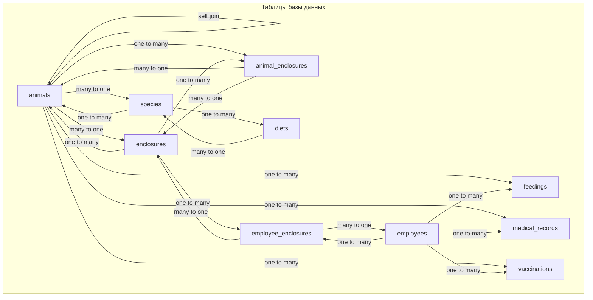

# 🐧 База данных "Зоопарк"

## 📋 Описание проекта

Данная база данных предназначена для хранения информации о животных, обитающих в зоопарке. Содержит данные о видах, характеристиках, ареалах обитания, условиях содержания, кормлении, медицинских записях и особенностях размножения животных. Также включает информацию о сотрудниках, вольерах и вакцинации.

## 🗄️ Структура базы данных

База данных состоит из следующих файлов:

- `create_animals_db.sql` - создание структуры базы данных (таблицы, связи)
- `add_data_animals_db.sql` - наполнение базы данных начальными данными
- `create_views_animals_db.sql` - создание представлений (views) для удобного доступа к данным
- `on_views_animals_db.sql` - примеры запросов к представлениям

## 🏗️ Структура таблиц

Проект включает следующие таблицы:

| Таблица | Описание | Основные поля |
| --- | --- | --- |
| `species` | Виды животных | название, латинское название, класс, статус охраны, описание |
| `enclosures` | Вольеры и места обитания | название, тип, площадь, вместимость, температурный режим, влажность |
| `employees` | Сотрудники зоопарка | имя, фамилия, должность, телефон, email, дата найма |
| `animals` | Животные | кличка, вид, дата рождения, пол, состояние здоровья, дата прибытия, вольер, родители |
| `feedings` | Кормления | животное, сотрудник, тип еды, количество, время, дата, заметки |
| `medical_records` | Медицинские записи | животное, ветеринар, дата осмотра, диагноз, лечение, лекарства, следующая проверка |
| `vaccinations` | Вакцинация | животное, название вакцины, дата вакцинации, срок действия, кто сделал |
| `diets` | Диеты | вид, описание питания, частота кормлений, суточная норма |
| `animal_enclosures` | История размещения | животное, вольер, дата начала, дата окончания, причина |
| `employee_enclosures` | Назначения сотрудников | сотрудник, вольер, дата назначения |

## 📊 ERD-диаграмма (Entity Relationship Diagram)



### Описание связей:
- `animals` ←→ `species`: Одно животное принадлежит одному виду, один вид может иметь много животных (one-to-many)
- `animals` ←→ `enclosures`: Одно животное находится в одном вольере, один вольер может содержать много животных (one-to-many)
- `animals` ←→ `animals` (self-join): Животное может иметь родителей (мать и отец - это тоже животные)
- `animals` ←→ `feedings`: Одно животное может иметь много записей о кормлениях (one-to-many)
- `animals` ←→ `medical_records`: Одно животное может иметь много медицинских записей (one-to-many)
- `animals` ←→ `vaccinations`: Одно животное может иметь много вакцинаций (one-to-many)
- `employees` ←→ `feedings`: Один сотрудник может делать много кормлений (one-to-many)
- `employees` ←→ `medical_records`: Один сотрудник (ветеринар) может сделать много медицинских записей (one-to-many)
- `employees` ←→ `vaccinations`: Один сотрудник может делать много вакцинаций (one-to-many)
- `species` ←→ `diets`: Один вид может иметь одну диету, одна диета применяется к одному виду (one-to-one)
- `animals` ←→ `animal_enclosures`: История размещения животного в вольерах
- `employees` ←→ `employee_enclosures`: Назначение сотрудников на вольеры

## 🐧 Описание видов животных

| Вид | Латинское название | Внешний вид | Размеры | Ареал обитания | Охранный статус | Образ жизни | Размножение |
| --- | --- | --- | --- | --- | --- | --- | --- |
| Пингвин Гумбольдта | Spheniscus humboldti | Чёрные спина и голова, белое брюхо с чёрным кольцом, белые «очки» вокруг глаз, чёрный клюв с красным основанием | Длина: 65-70 см, вес: 4-5 кг | Скалистые побережья Южной Америки (Перу и Чили) в зоне холодного Перуанского течения | Уязвимый вид (VU). Численность снижается, около 12 000 пар | Ныряет на глубину до 20-30 м. Основу рациона составляют рыбы (анчоусы, сардины) и кальмары | Пары постоянны. Откладывает 1-2 яйца в любое время года, насиживание 38-45 дней |
| Королевский пингвин | Aptenodytes patagonicus | Яркие оранжевые пятна по бокам головы и на горле, серо-серебристая спина, длинный тонкий клюв | Длина: 85-100 см, вес: 10-15 кг | Субантарктические острова (Южная Георгия, Фолкленды и др.) | Вызывающий наименьшие опасения (LC). Популяция стабильна, более 1 млн пар | Рекордсмен по нырянию среди пингвинов: до 343 м и до 9 мин под водой. Питается рыбой и головоногими моллюсками | Самый длинный цикл размножения среди птиц — 14-16 месяцев. Откладывает 1 яйцо в начале лета (декабрь-январь) |
| Амурский тигр | Panthera tigris altaica | Крупнейший подвид тигра с оранжевой шерстью с черными полосами | Длина до 3 м, вес до 300 кг | Дальний Восток России | Исчезающий (EN) | Хищник, ведущий одиночный образ жизни | Приносит 2-4 детеныша, беременность длится около 3,5 месяцев |
| Большая панда | Ailuropoda melanoleuca | Черно-белое млекопитающее с характерными черными пятнами вокруг глаз | Длина до 1,8 м, вес до 150 кг | Горные леса Центрального Китая | Уязвимый (VU) | Питается преимущественно бамбуком (до 99% рациона) | Приносит 1-2 детеныша, которые развиваются очень медленно |
| Африканский слон | Loxodonta africana | Крупнейшее наземное животное с большими ушами и длинным хоботом | Высота до 4 м, вес до 6 тонн | Саванны, леса и болота Африки | Уязвимый (VU) | Живет в стадах, имеет сложную социальную структуру | Беременность длится 22 месяца - самая долгая среди млекопитающих |
| Белый медведь | Ursus maritimus | Крупный хищник с белой шерстью, хорошо приспособленный к жизни в Арктике | Длина до 3 м, вес до 800 кг | Арктика, побережья и льды Северного Ледовитого океана | Уязвимый (VU) | Охотится на тюленей, проводит много времени на морском льду | Самки рождают 1-2 медвежат зимой в снежных берлогах |
| Лев | Panthera leo | Крупная кошка, самцы имеют характерную гриву | Длина до 2,5 м, вес до 250 кг | Саванны и открытые леса Африки | Уязвимый (VU) | Живет в прайдах, где самки занимаются охотой | Приносит 2-4 львят, которые воспитываются всем прайдом |
| Жираф | Giraffa camelopardalis | Самое высокое наземное животное с характерными пятнистыми окрасами | Высота до 6 м, вес до 1,5 тонн | Саванны и открытые леса Африки | Уязвимый (VU) | Питается листьями акаций, может обходиться без воды несколько дней | Беременность длится около 15 месяцев, приносит одного теленка |
| Горилла | Gorilla gorilla | Крупнейшая человекообразная обезьяна с мощным телосложением | Высота до 1,8 м, вес до 200 кг | Тропические леса Центральной Африки | Критически endangered (CR) | Живет в группах, возглавляемых серебристым самцом | Приносит одного детеныша с интервалом 4-6 лет |
| Красная панда | Ailurus fulgens | Маленькое деревенское млекопитающее с пушистым рыжим хвостом | Длина до 65 см, вес до 6 кг | Горные бамбуковые леса Гималаев | Исчезающий (EN) | Питается бамбуком, фруктами и мелкими животными | Приносит 1-4 детенышей в бамбуковых гнездах |
| Фламинго | Phoenicopterus roseus | Розовая птица с длинными ногами и изогнутым клювом | Высота до 1,5 м, вес до 4 кг | Солоноватые озера, лагуны и болота | Наименьшие опасения (LC) | Живет в больших колониях, питается планктоном и мелкими ракообразными | Откладывает одно яйцо на глиняной возвышении |
| Бенгальский тигр | Panthera tigris tigris | Один из крупнейших подвидов тигра, с ярко выраженным окрасом | Длина до 3 м, вес до 250 кг | Леса и саванны Индии и соседних стран | Исчезающий (EN) | Территориальный хищник, ведущий одиночный образ жизни | Приносит 2-4 детенышей, которых защищает до 2 лет |
| Кенгуру | Macropus giganteus | Сумчатое животное с мощными задними ногами и хвостом | Высота до 2 м, вес до 90 кг | Австралия, открытые ландшафты и леса | Наименьшие опасения (LC) | Живет в группах, передвигается прыжками | Самка вынашивает одного детеныша в сумке до 8 месяцев |
| Анаконда | Eunectes murinus | Массивная змея с оливково-зеленым окрасом и темными пятнами | Длина до 9 м, вес до 250 кг | Бассейн реки Амазонки и Ориноко | Наименьшие опасения (LC) | Водяная змея, охотящаяся на крупную дичь | Является живородящей, приносит до 80 детенышей |
| Дельфин-афалина | Tursiops truncatus | Интеллектуальное морское млекопитающее с характерным изгибом спинного плавника | Длина до 4 м, вес до 650 кг | Океаны и прибрежные воды по всему миру | Наименьшие опасения (LC) | Живет в сложных социальных группах, обладает высоким интеллектом | Беременность длится 12 месяцев, приносит одного теленка |
| Полярная сова | Bubo scandiacus | Крупная белая сова с пятнистой окраской, адаптированная к холоду | Длина до 65 см, размах крыльев до 1,6 м | Арктические тундры и полярные регионы | Наименьшие опасения (LC) | Хищная птица, питающаяся в основном леммингами | Откладывает до 11 яиц в зависимости от доступности пищи |

## 📋 Описание представлений (Views)

В проекте реализованы следующие представления для удобного доступа к данным:

| Название представления | Описание | Основные поля | Использование |
| --- | --- | --- | --- |
| `animals_full_info` | Полная информация о животных с деталями вида и вольера | ID, кличка, вид, латинское название, класс, статус охраны, пол, возраст, состояние здоровья, дата прибытия, вольер | Для получения полной информации о текущих животных |
| `todays_feeding_schedule` | Расписание кормлений на сегодня | ID, кличка животного, вид, время кормления, тип еды, количество, сотрудник, должность, заметки | Для планирования ежедневного кормления |
| `animal_relocation_history` | История перемещений животных между вольерами | кличка, вид, вольер откуда, вольер куда, даты начала/окончания, причина | Для отслеживания истории размещения |
| `medical_history` | Медицинская история животных | кличка, вид, дата осмотра, диагноз, лечение, лекарства, следующая проверка, ветеринар, должность | Для медицинского контроля |
| `enclosure_statistics` | Статистика по вольерам | ID, название, тип, площадь, вместимость, текущие животные, список видов, ответственный сотрудник | Для управления вольерами |
| `vaccination_due` | Животные, нуждающиеся в вакцинации | кличка, вид, название вакцины, даты, статус, кто делал | Для контроля сроков вакцинации |
| `animal_diet_schedule` | Расписание питания по животным | кличка, вид, описание питания, частота, норма, время и дата кормления | Для планирования питания |
| `family_tree` | Родственные связи животных | кличка потомка, дата рождения, клички родителей, вид | Для отслеживания родословной |
| `employee_responsibilities` | Обязанности сотрудников | ID, ФИО, должность, стаж, вольеры, количество обслуживаемых животных | Для распределения обязанностей |
| `daily_health_report` | Ежедневный отчет по здоровью | кличка, вид, состояние, последняя проверка, срок вакцинации, комментарий | Для мониторинга состояния здоровья |

## 💡 Примеры использования

Вот несколько примеров SQL-запросов для работы с базой данных:

**1. Получить список всех животных с их видами и статусом охраны:**
```sql
SELECT a.name AS Животное, s.name AS Вид, s.conservation_status AS Статус_охраны
FROM animals a
JOIN species s ON a.species_id = s.id;
```

**2. Найти всех животных, находящихся в определенном вольере:**
```sql
SELECT a.name AS Животное, e.name AS Вольер, ae.start_date AS Дата_размещения
FROM animal_enclosures ae
JOIN animals a ON ae.animal_id = a.id
JOIN enclosures e ON ae.enclosure_id = e.id
WHERE e.name = 'Пингвинарий';
```

**3. Получить информацию о последнем медицинском осмотре животного:**
```sql
SELECT a.name AS Животное, mr.record_date AS Дата_осмотра, mr.diagnosis AS Диагноз, v.first_name AS Ветеринар
FROM medical_records mr
JOIN animals a ON mr.animal_id = a.id
JOIN employees v ON mr.vet_id = v.id
WHERE mr.record_date = (
    SELECT MAX(record_date) 
    FROM medical_records 
    WHERE animal_id = a.id
);
```

**4. Найти сотрудников, ответственных за определенный вольер:**
```sql
SELECT emp.first_name, emp.last_name, pos.position, enc.name AS Вольер
FROM employee_enclosures ee
JOIN employees emp ON ee.employee_id = emp.id
JOIN enclosures enc ON ee.enclosure_id = enc.id
JOIN (SELECT employee_id, position FROM employees) pos ON emp.id = pos.employee_id;
```

## 📝 TODO

- [x] Добавить описание остальных видов животных из файла `add_data_animals_db.sql`
- [x] Расширить раздел с технической документацией
- [x] Добавить примеры SQL-запросов
- [x] Добавить ERD-диаграмму базы данных
- [x] Описать все представления из `create_views_animals_db.sql`
- [x] Добавить индексы для оптимизации запросов
- [x] Добавить триггеры и ограничения для обеспечения целостности данных
- [x] Добавить хранимые процедуры для часто используемых операций
- [x] Добавить автоматизированные тесты для проверки корректности работы процедур
- [x] Создать API-интерфейс для взаимодействия с базой данных
- [x] Добавить документацию по API
- [x] Добавить систему резервного копирования базы данных
- [x] Создать систему мониторинга и алертинга для базы данных
- [x] Создать систему аутентификации и авторизации пользователей
- [x] Создать систему логирования действий пользователей
- [x] Создать систему архивирования старых данных
- [x] Добавить систему аналитики и отчетности
- [x] Оптимизировать производительность запросов
- [x] Завершить комплексное улучшение проекта

## 🛠️ Использование

1. Установите `MySQL 8.0` или выше
2. Создайте базу данных, выполнив скрипт `create_animals_db.sql`
3. Наполните базу данными из файла `add_data_animals_db.sql`
4. Создайте представления с помощью `create_views_animals_db.sql`
5. Оптимизируйте производительность, добавив индексы из файла `indexes.sql`
6. Добавьте триггеры и ограничения из файла `triggers_constraints.sql`
7. Создайте хранимые процедуры из файла `stored_procedures.sql`
8. Выполните тестирование с помощью скрипта `tests.sql`
9. Изучите примеры использования в файле `examples.sql`
10. Выполняйте запросы к представлениям из файла `on_views_animals_db.sql`
11. Для проверки целостности данных выполните скрипт `add_data_animals_db.sql` до конца, он включает проверку количества записей в каждой таблице

## 📊 Техническая информация

- **СУБД:** MySQL
- **Кодировка:** UTF-8
- **Версия:** 8.0+

---

### 💼 Профиль на Profi.ru

[](https://profi.ru/profile/DupleyMI)

> Консультации и услуги программирования на платформе Profi.ru

---

### 📚 Услуги обучения

[](https://kwork.ru/usability-testing/42465951/obuchenie-tekhnologiyam-i-yazykam-programmirovaniya)

> Профессиональное обучение технологиям и языкам программирования. Персональные консультации и курсы от опытного преподавателя.

---

### 🏫 О школе

[](https://school-maestro7it.ru/)

> Инновационная школа программирования, специализирующаяся на подготовке специалистов в области современных технологий и языков программирования.

---

💼 **Автор:** Дуплей Максим Игоревич

📲 **Telegram №1:** [@quadd4rv1n7](https://t.me/quadd4rv1n7)

📲 **Telegram №2:** [@dupley_maxim_1999](https://t.me/dupley_maxim_1999)

📅 **Дата:** 07.02.2026

▶️ **Версия 1.6**

```textline
※ Предложения по сотрудничеству можете присылать на почту ※
📧 maksimqwe42@mail.ru
```
