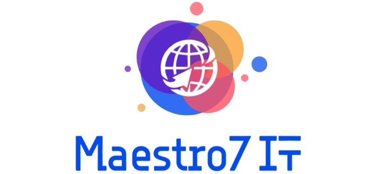

# Школа программирования Maestro7IT



## 🌐 Программирование на PHP для начинающих </>

### План обучения

```
▶️ Перечень уроков (вебинаров) для онлайн-курса по проектированию и разработке веб-приложений:
1️⃣ Вводное занятие: знакомство с курсом и настройка окружения
2️⃣ Введение в PHP: синтаксис, переменные, типы данных, операторы
3️⃣ Массивы, циклы, функции и работа с формами
4️⃣ Работа с файлами, сессиями, cookie и заголовками
5️⃣ ООП в PHP: классы, объекты, наследование, автозагрузка
6️⃣ Работа с базой данных (MySQL) и PDO
7️⃣ Введение в Laravel: установка, структура проекта, Artisan
8️⃣ Маршрутизация и Blade шаблонизатор
9️⃣ Модели и Eloquent ORM (часть 1)
🔟 Модели и Eloquent ORM (часть 2) — Связи
1️⃣1️⃣ Контроллеры и MVC-архитектура
1️⃣2️⃣ Формы, валидация и обработка файлов
1️⃣3️⃣ Аутентификация и авторизация (Auth)
1️⃣4️⃣ Middleware, Сессии, Flash-сообщения
1️⃣5️⃣ Работа с базой данных: Migrations, Seeders, Factories
1️⃣6️⃣ API и JSON-ответы (REST)
1️⃣7️⃣ Композиция и пакеты. Тестирование (PHPUnit)
1️⃣8️⃣ Работа с очередями, почтой и уведомлениями
1️⃣9️⃣ Деплой и производительность
2️⃣0️⃣ Введение в React и экосистему
2️⃣1️⃣ Компоненты, состояние и props
2️⃣2️⃣ Маршрутизация в React
2️⃣3️⃣ Управление состоянием (Context API, Redux Toolkit)
2️⃣4️⃣ Работа с API в React
2️⃣5️⃣ Стилизация в React
2️⃣6️⃣ Тестирование в React
2️⃣7️⃣ Оптимизация и деплой
2️⃣8️⃣ Финальный проект — Полное веб-приложение
```


---

💼 **Автор:** Дуплей Максим Игоревич

📲 **Telegram №1:** [@quadd4rv1n7](https://t.me/quadd4rv1n7)

📲 **Telegram №2:** [@dupley_maxim_1999](https://t.me/dupley_maxim_1999)

📅 **Дата:** 07.09.2024

▶️ **Версия 1.0**

```textline
※ Предложения по сотрудничеству можете присылать на почту ※
📧 maksimqwe42@mail.ru
```
