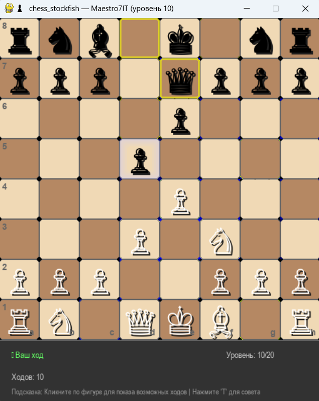

# ♟️ chess_stockfish

**Образовательная шахматная игра с искусственным интеллектом Stockfish**  

Создано для школы программирования [Maestro7IT](https://school-maestro7it.ru/)  

**Автор:** Дуплей М.И. — преподаватель, DevOps-инженер, философ и музыкант



---

## 🌟 Возможности

- Графический интерфейс на **Pygame**
- Игра против **Stockfish** (уровень сложности от 0 до 20)
- Выбор стороны: **белые** или **чёрные**
- Поддержка всех правил шахмат через Stockfish (включая рокировку, взятие на проходе, мат/пат)
- Unicode-отображение фигур (без внешних изображений)
- Кроссплатформенность: Windows, macOS, Linux
- Отображение оценки позиции в реальном времени
- Выделение последних ходов
- Информационная панель с подробной статистикой
- История ходов и позиций
- Подсказки возможных ходов
- Улучшенная обработка ошибок
- **Оптимизированная производительность**
- Визуальная обратная связь по ходам
- Улучшенная графика с эффектами теней и свечения
- Интерактивные элементы с эффектами наведения
- Современный дизайн с закругленными углами
- **Интеллектуальные подсказки** - объяснения причин недопустимых ходов
- **Образовательные функции** - помощь в понимании правил шахмат
- **Интерактивное обучение** - автоматические советы и подсказки
- **Цветовые темы** - выбор из нескольких визуальных тем
- **🔊 Звуковая система** - аудиообратная связь для игровых событий
- **⏱ Таймеры ходов** - отслеживание времени, затраченного на ходы
- **✨ Исправлены визуальные артефакты** - улучшенное отображение кругов вокруг фигур
- **🎮 Игровое меню** - доступ к настройкам и функциям во время игры
- **🎯 Оптимизированное меню** - улучшенная навигация и визуальные эффекты
- **🚀 Оптимизированный рендеринг** - улучшенная стабильность и производительность
- **🔧 Исправлены артефакты при клике на фигуры** - чистая и стабильная отрисовка
- **💾 Сохранение и загрузка партий** - возможность продолжить игру позже
- **🗑 Управление сохраненными партиями** - удаление ненужных сохранений
- **📋 Расширенное меню загрузки** - отображение информации о сохраненных партиях
- **⚡ Расширенные оптимизации производительности** - улучшенное кэширование и более высокие частоты обновления
- **📈 Мониторинг производительности** - отслеживание CPU, памяти и времени выполнения
- **🧠 Управление памятью** - автоматическая очистка кэшей и предотвращение утечек
- **🧵 Многопоточность** - асинхронная обработка задач
- **✨ Плавные обновления** - интерполированные переходы и анимации

---

## 📋 Требования

- Python 3.7+
- Pygame
- Stockfish engine
- python-chess
- psutil (для мониторинга производительности)

---

## 🚀 Установка

1. Установите зависимости:
```bash
pip install pygame stockfish python-chess psutil
```

2. Установите Stockfish:
   - **Windows**: Запустите `install_stockfish.bat`
   - **Linux**: `sudo apt-get install stockfish`
   - **macOS**: `brew install stockfish`

3. (Опционально) Для GPU ускорения установите CuPy:
   - **NVIDIA**: `pip install cupy-cuda12x`
   - **AMD/Intel**: Используйте NumPy (устанавливается автоматически)

---

## ▶️ Запуск

### Стандартная версия:
```bash
python main.py
```

### Оптимизированная версия (рекомендуется):
```bash
python main_optimized.py
```

---

## 📚 Документация

- [Документация по оптимизациям](docs/code_optimizations.md)
- [Исправление проблемы с координатами](docs/coordinate_fix.md)
- [Графические улучшения](docs/graphics_improvements.md)
- [Исправление визуальных артефактов](summary/VISUAL_FIXES_SUMMARY.md)
- [Сводка всех улучшений](summary/FINAL_IMPROVEMENTS_SUMMARY.md)
- [Функции игрового меню](summary/IN_GAME_MENU_FEATURES.md)
- [Использование игрового меню](docs/IN_GAME_MENU_USAGE.md)
- [Итоговая сводка проекта](summary/FINAL_PROJECT_SUMMARY.md)
- [Оптимизация меню](summary/MENU_OPTIMIZATION_SUMMARY.md)
- [Оптимизация рендеринга](summary/RENDERING_OPTIMIZATIONS.md)
- [Исправление артефактов](summary/ARTIFACT_FIX_SUMMARY.md)
- [Оптимизация производительности](summary/OPTIMIZATION_SUMMARY.md)
- [Сравнение производительности](tests/performance_comparison.py)

---

## 🧪 Тестирование

Запустите автоматизированные тесты:
```bash
python tests/automated_test.py
```

Протестируйте звуковую систему:
```bash
python tests/test_sound_manager.py
```

Протестируйте исправления визуальных артефактов:
```bash
python tests/test_visual_fixes.py
```

Протестируйте игровое меню:
```bash
python demos/test_in_game_menu.py
```

Протестируйте интеграцию всех компонентов:
```bash
python demos/integration_test.py
```

Протестируйте оптимизации меню:
```bash
python demos/test_menu_improvements.py
```

Протестируйте оптимизации рендеринга:
```bash
python demos/test_rendering_optimizations.py
```

Протестируйте исправление артефактов:
```bash
python demos/test_artifact_fix.py
```

Протестируйте сохранение и загрузку партий:
```bash
python tests/test_save_load.py
```

Протестируйте удаление сохраненных партий:
```bash
python tests/test_delete_saved_games.py
```

Протестируйте улучшения производительности:
```bash
python tests/test_performance_improvements.py
```

**Новые тесты производительности:**
```bash
python demos/demonstrate_performance_improvements.py
```

Сравните производительность оригинальной и оптимизированной версий:
```bash
python tests/performance_comparison.py
```

Продемонстрируйте новые улучшения:
```bash
python demos/demonstrate_improvements.py
```

Продемонстрируйте сохранение и загрузку партий:
```bash
python demos/demonstrate_save_load.py
```

Продемонстрируйте удаление сохраненных партий:
```bash
python demos/demonstrate_delete_games.py
```

Продемонстрируйте улучшения производительности:
```bash
python demos/demonstrate_performance_improvements.py
```

---

## 🎮 Управление

- **Клик левой кнопкой мыши** - выбрать фигуру / сделать ход
- **R** - новая игра
- **ESC** - игровое меню
- **T** - показать образовательный совет
- **←/→** - навигация по истории ходов
- **A** - анализ текущей позиции
- **S** - сохранить партию
- **L** - загрузить партию
- **G** - резюме игры
- **D** - детальный анализ

---

## 📈 Образовательная ценность

Этот проект создан для обучения программированию и шахматам:
- Изучение Pygame и графического интерфейса
- Работа с внешними библиотеками (Stockfish)
- Понимание шахматных правил и нотации (FEN, UCI)
- Оптимизация производительности и архитектура приложений
- Обработка ошибок и пользовательский опыт
- Создание интерактивных обучающих систем
- Разработка с адаптивным пользовательским интерфейсом
- **Работа со звуком в Python**
- **Отслеживание метрик производительности**
- **Исправление визуальных артефактов в графике**
- **Разработка игровых меню и интерфейсов**
- **Оптимизация пользовательского опыта**
- **Оптимизация графического рендеринга**
- **Устранение визуальных артефактов**
- **Работа с файловой системой**
- **Сериализация данных в JSON**
- **Управление сохраненными данными**
- **Продвинутая оптимизация производительности**
- **Мониторинг ресурсов системы**
- **Управление памятью и кэшированием**
- **Многопоточное программирование**

---

## 📊 Мониторинг производительности

Проект включает встроенный монитор производительности, который отслеживает:
- Использование CPU и памяти
- Время выполнения операций
- Количество событий и ошибок
- Эффективность кэширования

Для доступа к данным мониторинга используйте:
```python
from utils.performance_monitor import get_performance_monitor

monitor = get_performance_monitor()
summary = monitor.get_performance_summary()
```

---

## 🚀 Ключевые оптимизации

1. **Агрессивное кэширование** - кэширование состояния доски, оценки позиции и допустимых ходов
2. **Управление памятью** - автоматическая очистка кэшей и ограничение их размера
3. **Многопоточность** - асинхронная обработка задач с пулом потоков
4. **Плавные обновления** - интерполированные переходы и анимации
5. **Оптимизированный рендеринг** - рендеринг только измененных областей
6. **Мониторинг производительности** - отслеживание метрик в реальном времени

---

## 📄 Лицензия

MIT License - см. файл [LICENSE](LICENSE)