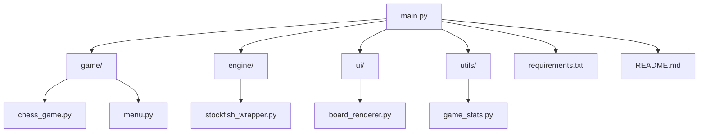
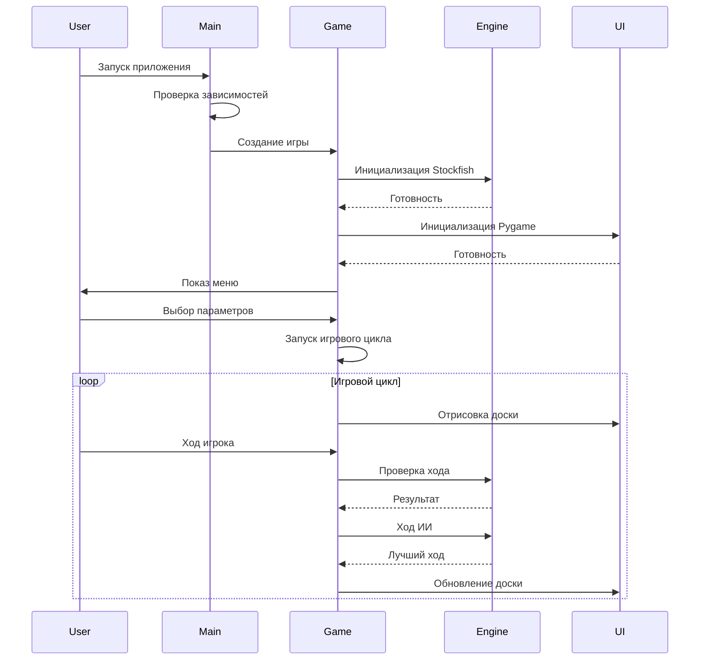

# Архитектура проекта chess_stockfish

## Общая структура

## Компоненты проекта

### 1. Основной модуль ([main.py](file://c:\Users\maksi\OneDrive\Documents\GitHub\maestro7it_education\python\solution_tasks\chess_stockfish\main.py))
- Точка входа в приложение
- Инициализация Pygame
- Запуск меню и игрового цикла
- Обработка ошибок и исключений

### 2. Игровая логика ([game/](file://c:\Users\maksi\OneDrive\Documents\GitHub\maestro7it_education\python\solution_tasks\chess_stockfish\game))
- [chess_game.py](file://c:\Users\maksi\OneDrive\Documents\GitHub\maestro7it_education\python\solution_tasks\chess_stockfish\game\chess_game.py) - основная логика игры
- [menu.py](file://c:\Users\maksi\OneDrive\Documents\GitHub\maestro7it_education\python\solution_tasks\chess_stockfish\game\menu.py) - консольное меню

### 3. Движок ([engine/](file://c:\Users\maksi\OneDrive\Documents\GitHub\maestro7it_education\python\solution_tasks\chess_stockfish\engine))
- [stockfish_wrapper.py](file://c:\Users\maksi\OneDrive\Documents\GitHub\maestro7it_education\python\solution_tasks\chess_stockfish\engine\stockfish_wrapper.py) - обёртка для работы с Stockfish

### 4. Интерфейс ([ui/](file://c:\Users\maksi\OneDrive\Documents\GitHub\maestro7it_education\python\solution_tasks\chess_stockfish\ui))
- [board_renderer.py](file://c:\Users\maksi\OneDrive\Documents\GitHub\maestro7it_education\python\solution_tasks\chess_stockfish\ui\board_renderer.py) - отрисовка доски и интерфейса

### 5. Утилиты ([utils/](file://c:\Users\maksi\OneDrive\Documents\GitHub\maestro7it_education\python\solution_tasks\chess_stockfish\utils))
- [game_stats.py](file://c:\Users\maksi\OneDrive\Documents\GitHub\maestro7it_education\python\solution_tasks\chess_stockfish\utils\game_stats.py) - статистика игр

## Поток данных

## Зависимости

### Python библиотеки
- `pygame` - графический интерфейс
- `stockfish` - Python обёртка для Stockfish
- `python-chess` - работа с шахматными позициями

### Внешние зависимости
- `Stockfish` - шахматный движок (исполняемый файл)

## Обработка ошибок

Проект включает несколько уровней обработки ошибок:

1. **Проверка зависимостей** - на старте приложения
2. **Обработка исключений Stockfish** - в обёртке движка
3. **Графические ошибки** - в модуле отрисовки
4. **Ошибки ввода** - в меню и игровой логике

## Режимы работы

1. **Полнофункциональный режим** - с установленным Stockfish
2. **Ограниченный режим** - без Stockfish (только для демонстрации)