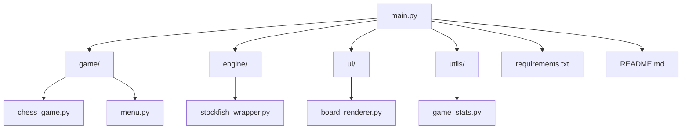

# Project Structure

```mermaid
graph TD
    A[main.py] --> B[game/]
    A --> C[engine/]
    A --> D[ui/]
    A --> E[utils/]
    
    B --> B1[chess_game.py]
    B --> B2[menu.py]
    
    C --> C1[stockfish_wrapper.py]
    
    D --> D1[board_renderer.py]
    
    E --> E1[game_stats.py]
    
    A --> F[requirements.txt]
    A --> G[README.md]
```