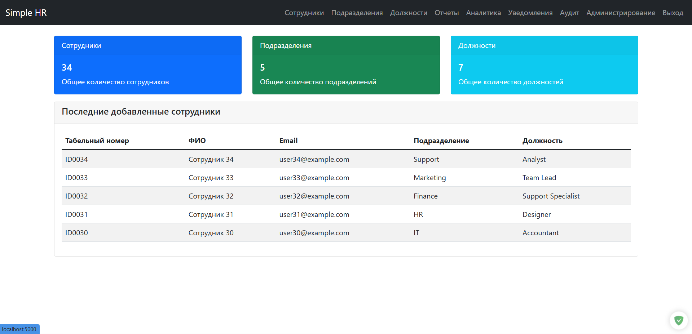

# Простая система управления HR


Простая система управления `HR`, построенная на `Flask` для управления сотрудниками, отделами, должностями, приказами и отпусками.

## Возможности

- Аутентификация пользователей (**роли admin/hr**)
- Управление сотрудниками (**операции CRUD**)
- Управление отделами и должностями
- Управление приказами (**прием, переводы, увольнения**)
- Отслеживание отпусков
- Возможности отчетности
- Функциональность импорта/экспорта `CSV`
- Адаптивный веб-интерфейс

## Используемые технологии

- **Бэкенд**: Flask (Python)
- **База данных**: MySQL с ORM SQLAlchemy
- **Фронтенд**: Bootstrap 5, HTML, CSS
- **Аутентификация**: Flask-Login
- **Обработка данных**: pandas, chardet
- **Другие**: python-dotenv, python-dateutil




## Установка

1. Клонируйте репозиторий:

   ```bash
   git clone <repository-url>
   cd simple_hr
   ```

2. Создайте виртуальное окружение:

   ```bash
   python -m venv venv
   source venv/bin/activate  # В Windows: venv\Scripts\activate
   ```

3. **Установите зависимости:**

   ```bash
   pip install -r requirements.txt
   ```

4. **Настройте базу данных:**

   - Создайте базу данных `MySQL`
   - Обновите файл `.env` своими учетными данными базы данных
   - **Запустите SQL-скрипт для создания таблиц:**

     ```bash
     mysql -u username -p database_name < create_simple_hr_db.sql
     ```

5. **Настройте переменные окружения в `.env`:**

   ```bash
   SECRET_KEY=your_secret_key_here
   MYSQL_USER=your_mysql_username
   MYSQL_PASSWORD=your_mysql_password
   MYSQL_HOST=localhost
   MYSQL_DB=simple_hr_db
   ```

6. **Заполните начальные данные:**

   ```bash
   python seed_data.py
   ```

## Запуск приложения

```bash
python run.py
```

Приложение будет доступно по адресу `http://localhost:5000`

```bash
python run.py mode --dev
```

## Пользователи по умолчанию

- Администратор: имя пользователя `admin`, пароль `admin`
- HR: имя пользователя `hr`, пароль `hr`

## Структура проекта

```bash
simple_hr/
├── app/
│   ├── routes/          # Обработчики маршрутов
│   ├── templates/       # HTML шаблоны
│   ├── utils/           # Вспомогательные функции
│   ├── __init__.py      # Фабрика приложения
│   └── models.py        # Модели базы данных
├── instance/
│   └── config.py        # Конфигурация
├── .env                 # Переменные окружения
├── create_simple_hr_db.sql  # Схема базы данных
├── requirements.txt     # Зависимости
├── run.py              # Точка входа в приложение
└── seed_data.py        # Начальное заполнение данных
```

## Функциональность

### Управление сотрудниками

- Добавление, редактирование, удаление сотрудников
- Просмотр деталей сотрудника
- Фильтрация сотрудников по отделам

### Управление отделами и должностями

- Управление отделами и должностями
- Предотвращение удаления при использовании

### Приказы

- Создание приказов о приеме, переводах и увольнениях
- Отслеживание перемещений сотрудников

### Отпуска

- Запись отпусков сотрудников
- Отслеживание типов отпусков (оплачиваемый, неоплачиваемый, больничный)

### Отчеты

- Генерация отчетов по сотрудникам
- Экспорт данных в CSV
- Просмотр статистики по отделам

### Импорт/Экспорт CSV

- Импорт данных сотрудников из CSV файлов
- Экспорт отчетов в формат CSV
- Автоматическое определение кодировки

## Лицензия

Этот проект предназначен для образовательных целей.